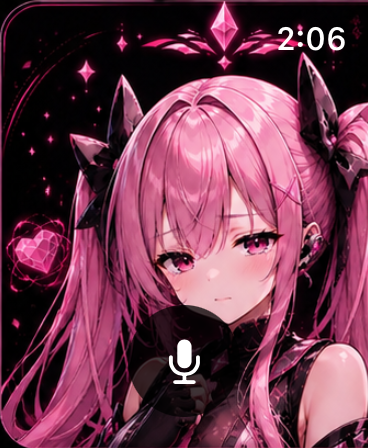

# Remi — watchOS AI Companion

A watchOS 10 voice companion app featuring Remi, a tsundere anime AI. Tap to talk, she responds with voice and changes expression based on emotion.

<p align="center">
  
</p>

---

## ⚠️ API Keys Required

**This app will not run without valid API keys.** Three external services are required:

| Service | Purpose | Get Key |
|---------|---------|---------|
| [xAI](https://console.x.ai) | STT + LLM | console.x.ai |
| [Fish Audio](https://fish.audio) | TTS | fish.audio |

Copy `WatchVoiceApp/Sources/Secrets.template.swift` → `Secrets.swift` and fill in all values before building.

---

## Why these services?

**STT — xAI Grok**
Fast and accurate. REST-based, no WebSocket complexity, works reliably over watchOS network stack.

**LLM — xAI Grok 3**
Fast response times and genuinely fun to talk to. The tsundere personality comes through well.

**TTS — Fish Audio**
The voice clone quality is unmatched for this character. No other service came close.

---

## Architecture

```
┌─────────────────────────────────────────────────────┐
│                   Apple Watch                        │
│                                                      │
│  [Mic] ──► AVAudioEngine (PCM 16kHz)                │
│                  │                                   │
│                  ▼                                   │
│         POST /v1/stt (WAV)                           │
│         xAI Grok STT ──► transcript                  │
│                  │                                   │
│                  ▼                                   │
│         POST /v1/chat/completions                    │
│         xAI Grok 3 ──► [emotion] text               │
│                  │                                   │
│          ┌───────┴──────────┐                        │
│          ▼                  ▼                        │
│   Face expression    POST /v1/tts                    │
│   (9 emotions)       Fish Audio ──► PCM stream       │
│                             │                        │
│                             ▼                        │
│                      AVAudioPlayerNode               │
│                      (pre-buffer 5 chunks)           │
└─────────────────────────────────────────────────────┘
```

**On launch:** LLM is called silently with a random prompt to pre-warm the connection — so the first real conversation starts fast.

---

## Setup

```bash
brew install xcodegen
git clone https://github.com/ydktech/remi-watch
cd remi-watch

cp WatchVoiceApp/Sources/Secrets.template.swift WatchVoiceApp/Sources/Secrets.swift
# → fill in xaiKey, fishApiKey, fishVoiceId

cp signing.xcconfig.template signing.xcconfig
# → fill in your Apple Team ID

xcodegen generate
open WatchVoiceApp.xcodeproj
```

## Project structure

```
WatchVoiceApp/
├── Sources/
│   ├── WatchVoiceApp.swift        # App entry
│   ├── ContentView.swift          # UI + emotion face switching
│   ├── AudioManager.swift         # STT / LLM / TTS pipeline
│   └── Secrets.template.swift     # API key template (copy → Secrets.swift)
└── Resources/
    ├── layers/                    # 9 emotion face sprites + source sheet
    └── Assets.xcassets/           # App icon
```

## Emotion mapping

LLM responses include emotion tags that drive face switching with crossfade:

| Tag | Face |
|-----|------|
| `[happy]` `[excited]` `[laughing]` | happy |
| `[sad]` `[sighing]` | sad |
| `[angry]` `[annoyed]` | angry |
| `[sarcastic]` | disgust |
| `[confident]` | confident |
| `[embarrassed]` | shy |
| default | neutral |
